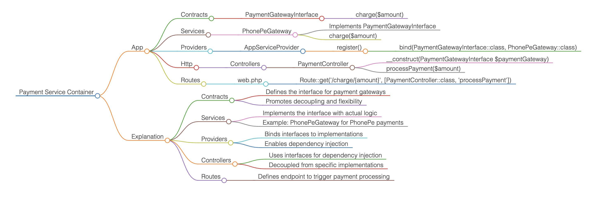

# Service Container In Laravel

The Laravel service container is a powerful tool for managing dependencies and performing dependency injection.

### Practical Example

Let's go through the steps to create a new Laravel project and implement a service container.

#### Step 1: Install Laravel

```
composer create-project laravel/laravel laravel-service-container
```

#### Step 2: Run project from parent directory

```
php artisan serve
```

#### Step 3: Create the Service container

Let's create a simple service. For example, we'll create a PaymentGatewayInterface and its implementation PhonePeGateway.

#### Step 3.1: Create the contract:

Create a new directory App/Contracts and inside it, create a file PaymentGatewayInterface.php

Contracts?
Purpose: This folder contains interface definitions.

Reasoning: Interfaces define a contract that classes must adhere to. By using interfaces, you can write more flexible and testable code. The implementation of these interfaces can be changed without affecting the code that depends on them.

Example: PaymentGatewayInterface in App/Contracts.

#### Step 3.2 Create the service implementing contract:

Create a new directory App/Services and inside it, create a file PhonePeGateway.php:

Purpose: This folder contains service classes that implement business logic.

Reasoning: Service classes are used to perform specific tasks and contain the core logic of the application. Organizing them in a Services folder helps to separate the logic from the rest of the application and makes it easier to manage and test.

Example: PhonePeGateway in App/Services.

#### Step 4  Bind the Service in a Service Provider:

You need to bind the interface to the implementation in a service provider. Open AppServiceProvider.php located in app/Providers and update the register method:

Purpose: This folder contains service providers.

Reasoning: Service providers are the central place of all Laravel application bootstrapping. They are responsible for binding classes into the service container and performing any application bootstrapping.

Example: AppServiceProvider in App/Providers.

#### 5 Use the Service in a Controller:

```
php artisan make:controller PaymentController

```
#### 6 Define a route for the controller function to execute payment process 

#### How It All Fits Together

Contract (Interface): Defines the methods that any payment gateway implementation must provide.

Service (Concrete Implementation): Provides the actual logic for the payment gateway.

Service Provider: Binds the interface to the concrete implementation, telling Laravel which class to instantiate when the interface is requested.

Controller: Depends on the interface, promoting flexibility and decoupling the controller from the specific implementation.

Route: Defines the endpoint to trigger the payment process.

#### Summary
Interfaces: Used in controllers to promote abstraction and decoupling.

Concrete Implementations: Created to provide the actual functionality as per the interface contract.

Service Providers: Used to bind interfaces to implementations, enabling dependency injection.

Controllers: Depend on interfaces, allowing for easy swapping of implementations and better testability.

This design pattern ensures that your application is flexible, maintainable, and adheres to good software design principles.




